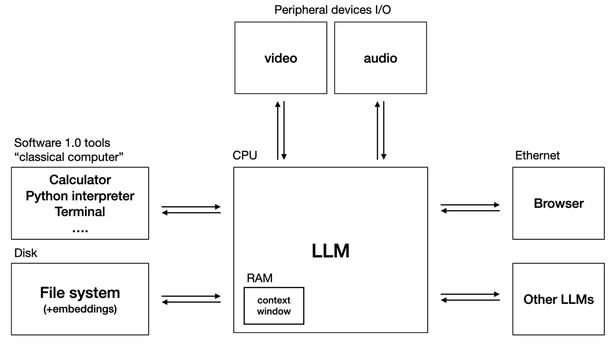

# LLM_OS

This is an implementation of LLM OS, an operating system with an LLM at the forefront decision making scheme.



## Setup

### Install Poetry

```shell
curl -sSL <https://install.python-poetry.org> | python3 -
```

### Install Dependencies

```shell
poetry shell
poetry install
```

If you're making changes in the repository, you can also install the pre-commit hooks with:

```shell
pre-commit install
```

## Details

### CPU

The heart of the OS, this LLM (usually the most capable model available) executes instructions and schedules downstream tasks.

### RAM

The context window of the CPU serves as the RAM.

### Storage

Retrieval-augmented generation (RAG) is used to store and retrieve data for reference. A vector databased stores embeddings of data. Multiple options are available for embeddings, both closed and open source.

### Tools

The OS comes with various tools to assist the LLM, such as calculators, python interpreters, internet, and shell access.
